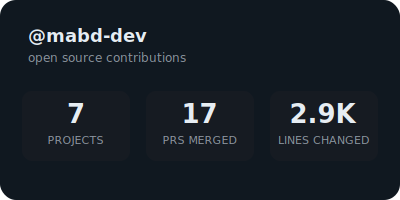
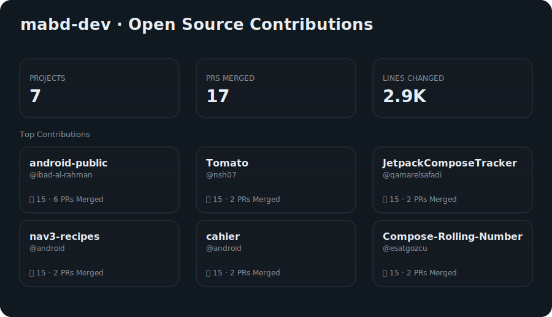
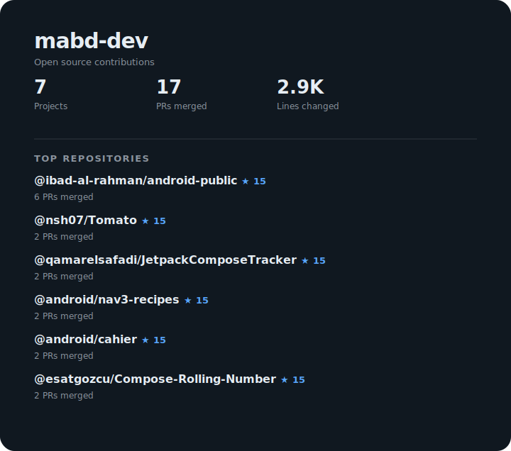

# gh-oss-stats

> **Showcase your open source contributions with auto-updating GitHub profile badges**

Track and display your merged PRs, commits, and contributions to external repositories with beautiful, auto-updating SVG badges. Perfect for GitHub profiles, portfolios, and resumes.

## ✨ Features

- 🚀 **2-Step GitHub Action** - Add auto-updating badges to your profile in minutes
- 🎨 **Auto-Updating Profile Badges** - Beautiful SVG badges in 4 styles (summary, compact, detailed)
- 🤖 **GitHub Actions Integration** - Set it and forget it, updates weekly automatically
- 🔍 **External Contribution Tracking** - Discovers all your merged PRs to repos you don't own
- 📊 **Comprehensive Stats** - Total PRs, commits, lines of code, and repository stars
- ⭐ **Smart Filtering** - Filter by minimum stars, exclude organizations
- 🎭 6 **Color Themes** - Match your profile's aesthetic
- 📦 **Developer-Friendly** - Use as a Go library or standalone CLI, outputs JSON


| Style |  Output  |
|------------|------------|
| Summary |  |
| Detailed |   |
| Compact |   |


### Multiple Variants Support

| Default Variant |  Text Based Variant  |
|------------|------------|
|  |  |


Check [All Combos](docs/badges/BADGE_THEMES.md)


## Quick Start

### Using GitHub Action (Recommended)

The easiest way to add auto-updating OSS badges to your GitHub profile is with our **official GitHub Action**. Just 2 steps:

**Step 1:** Create `.github/workflows/oss-badge.yml` in your profile repository:

```yaml
name: Generate OSS Badge
on:
  schedule:
    - cron: '0 0 * * 0'  # Weekly
  workflow_dispatch:

permissions:
  contents: write  # Required for auto-commit

jobs:
  generate:
    runs-on: ubuntu-latest
    steps:
      - uses: actions/checkout@v4
      - uses: mabd-dev/gh-oss-stats-action@v0.2.1
        with:
          github-token: ${{ secrets.GITHUB_TOKEN }}
          badge-output-path: 'oss-badge.svg'
```

**Step 2:** Add the badge to your profile README:

```markdown

```

**Done!** Your badge will auto-update weekly.

### Run it manually
If you don't want to wait for the end of the week, you can run this action manually
1. G to `your github repo`
2. Click `actions` tab
3. On the left side, you shouls see your action named `Generate OSS Badge`, click on it
4. Click on `run workflow` drop down, then click `run workflow`

That is it. It will run and generate the badge for you.

**Full documentation and examples:** [mabd-dev/gh-oss-stats-action](https://github.com/mabd-dev/gh-oss-stats-action)

---

### For Advanced Users (CLI)

For programmatic access, local testing, or custom integrations, you can use the CLI directly. See the [For Developers](#-for-developers) section below.

---

## Customization

### GitHub Action Inputs

Customize your badge by passing inputs to the action:

```yaml
- uses: mabd-dev/gh-oss-stats-action@v0.2.1
  with:
    github-token: ${{ secrets.GITHUB_TOKEN }}
    badge-path: 'images/oss-badge.svg'
    badge-style: 'detailed'      # summary, compact, or detailed
    badge-theme: 'nord'           # dark, light, nord, dracula, gruvbox-light, gruvbox-dark
    badge-variant: 'text-based'   # default or text-based
    min-stars: '100'              # Filter repos by minimum stars
    exclude-orgs: 'my-org,acme'   # Exclude specific organizations
```

**See the full list of options and examples:** [Action Documentation](https://github.com/mabd-dev/gh-oss-stats-action#inputs)

**Badge examples:** [Badge Gallery](docs/badges/README.md)

### Advanced CLI Options

For local development or custom integrations, see [docs/TECHNICAL.md](docs/TECHNICAL.md)


---

## 👨‍💻 For Developers

**Want auto-updating badges?** Use the [GitHub Action](#using-github-action-recommended) above.

**Need programmatic access or custom integrations?** This tool is also a full-featured Go library and CLI:

- **CLI Usage:** Fetch contribution stats as JSON for your own tools and scripts
- **Go Library:** Import `github.com/mabd-dev/gh-oss-stats/pkg/ossstats` in your Go projects
- **Local Testing:** `--debug` flag for instant testing with mock data (no API calls)
- **Custom Workflows:** Build your own automation beyond badges

📖 **Full technical documentation:** [docs/TECHNICAL.md](docs/TECHNICAL.md)

## License

See [LICENSE](LICENSE) file.

## Contributing

Contributions welcome! Please open an issue or PR.
