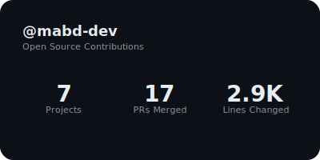
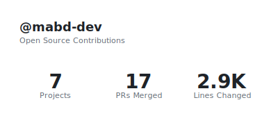
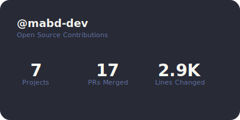
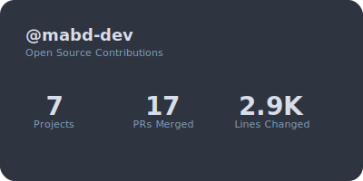

# Badge Themes

 # Badge Themes Gallery

  All available combinations of **Variants × Themes × Styles**.

  > **Note:** Text-Based variant currently only supports the Detailed style.
  > Summary and Compact styles are planned for future releases.

 ## How to Use This Guide

  Each row shows:
  - **Variant:** Design approach (Default = modern cards, Text-Based = clean typography)
  - **Theme:** Color scheme
  - **Detailed Style:** 900×360+ badge with stats and top repos
  - **Summary Style:** 400×200 badge with key metrics only

  Choose based on:
  - **Aesthetic:** Modern (Default) vs Clean (Text-Based)
  - **Theme:** Match your profile's color scheme
  - **Style:** Information density you want

| Variant | Theme | Detailed Style | Summary Style | Compact Style |
|---------|---------|------------|-------------|-------------|
| Default | Github Dark |  |  |  |
| Default | Github Light |  |  |  |
| Default | Dracula |  |  |  |
| Default | Nord |  |  |  |
| Default | Gruvbox Dark |  |  |  |
| Default | Gruvbox Light |  |  |  |
| Text Based | Github Dark |  |  |  |
| Text Based  | Github Light |  |  |  |
| Text Based  | Dracula |  |  |  |
| Text Based  | Nord |  |  |  |
| Text Based  | Gruvbox Dark |  |  |  |
| Text Based  | Gruvbox Light |  |  |  |

